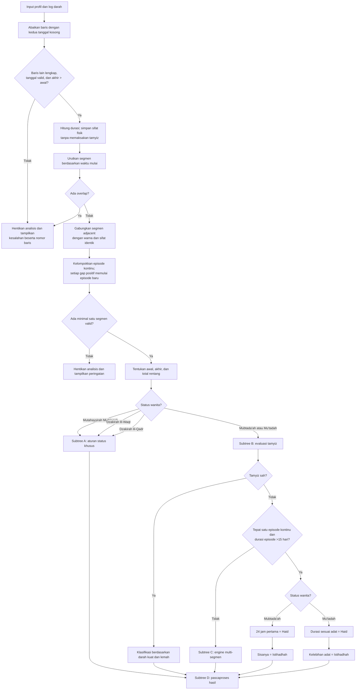
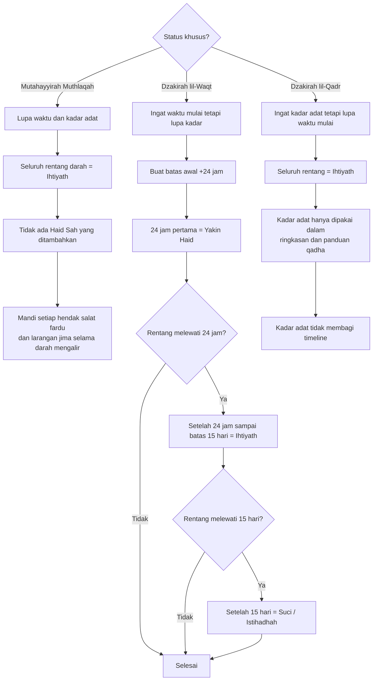
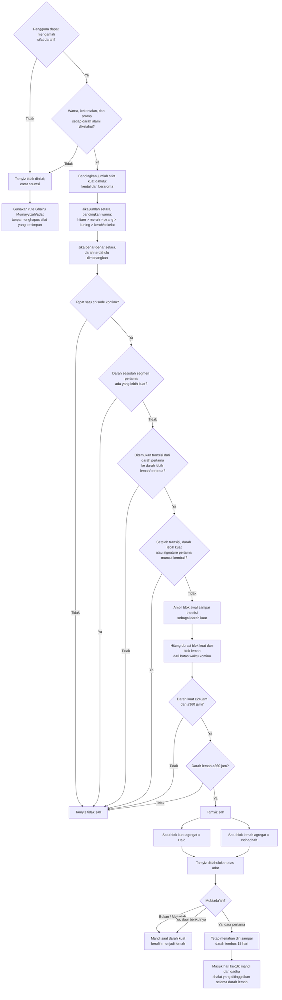
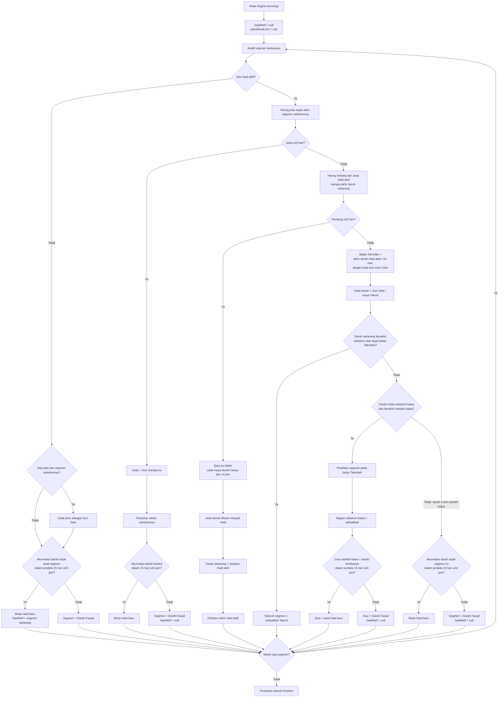
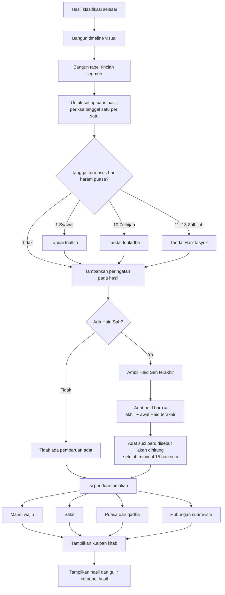

# Pohon Keputusan Logika Sistem

Dokumen ini adalah peta pengetahuan turunan dari DOCX kodifikasi terkoreksi dan
[`SISTEM_PAKAR_FIQIH_HAID_MASTER.html`](./SISTEM_PAKAR_FIQIH_HAID_MASTER.html).
Diagram menggambarkan urutan eksekusi kode, bukan verifikasi independen atas
kebenaran fikihnya. Kedua sumber kanonik harus tetap selaras; keputusan eksplisit
pengguna mengikuti aturan daur pertama Mubtada'ah Mumayyizah dalam DOCX.

## 1. Pohon routing utama

## 2. Subtree A — status khusus dan kehilangan ingatan

## 3. Subtree B — validasi tamyiz

## 4. Subtree C — engine multi-segmen, Sahb, dan Takmilah

## 5. Subtree D — pascaproses dan keluaran

## Status dokumen

- **Peran:** peta pengetahuan untuk memahami dan menavigasi logika program.
- **Otoritas:** turunan; bukan pengganti HTML kanonis.
- **Pemeliharaan:** perbarui setelah alur kontrol atau aturan klasifikasi pada HTML berubah.
